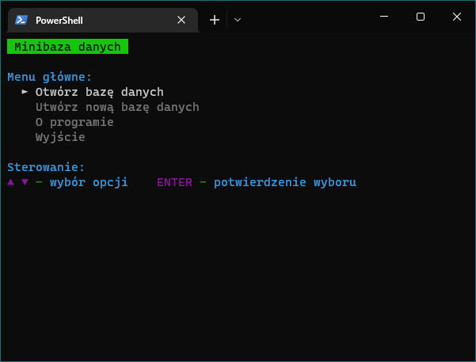
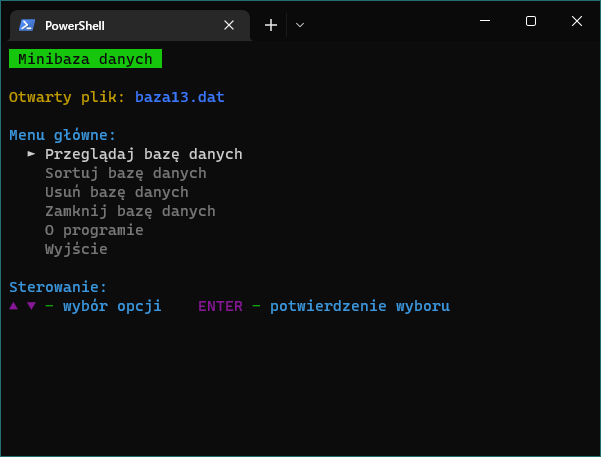
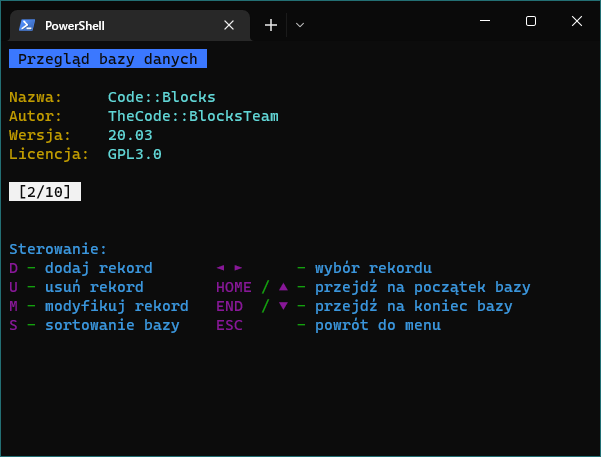
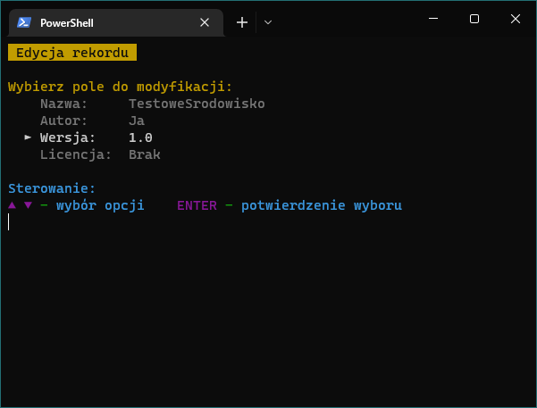

# Minibaza danych - IDE
Program został stworzony w ramach projektu zaliczeniowego na przedmiot Podstawy Programowania II.

## Kompilacja z MinGW
```bat
mkdir build
cd build
cmake -G "MinGW Makefiles" ..
cmake --build .
```

## Screenshoty




